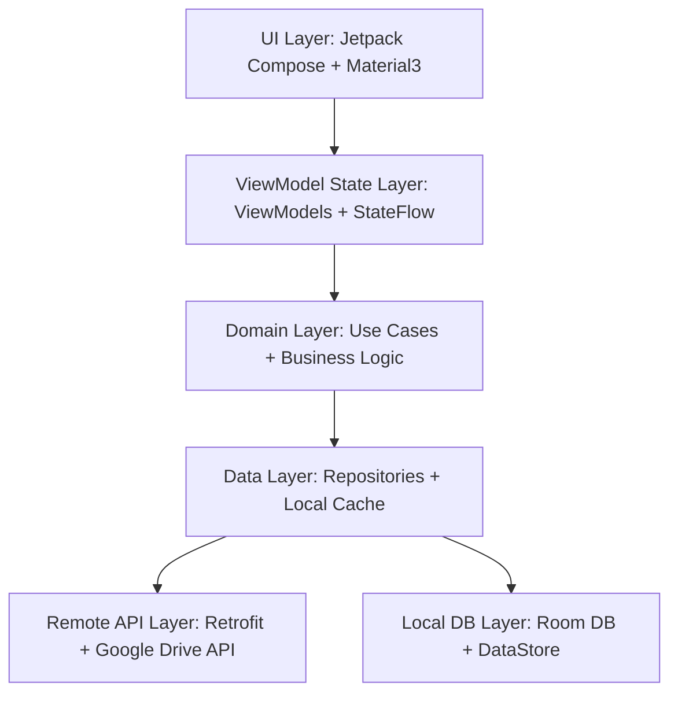

# GDrivePlay - Google Drive Video Player Android Application

GDrivePlay is a modern, premium Android video player application designed for streaming videos directly from Google Drive without downloading them. The application is styled with a gorgeous true dark-mode aesthetic inspired by MX Player, combining rich charcoal surfaces with vivid amber-orange accents (`#FF8C00`).

Built using **Kotlin**, **Jetpack Compose (Material 3)**, and **Media3 ExoPlayer**, GDrivePlay is fully structured around **Clean Architecture principles** and **MVVM** data states, using **Hilt** for dependency injection.

---

## 🏛️ Architecture Overview

GDrivePlay is structured into distinct, decoupled Clean Architecture layers to maintain a testable, maintainable, and robust codebase:



*   **UI Layer (`ui/`):** Standard Jetpack Compose screens, layouts, templates, and high-performance custom gesture coordinators.
*   **Domain Layer (`domain/`):** Holds the raw model data structures, Natural numeric sort comparators, and pure business Use Cases.
*   **Data Layer (`data/`):** Manages local databases (Room), preferences (DataStore), remote networking (Retrofit + OkHttp interceptors), auth tokens, and ExoPlayer's LRU caching datasource factory.

---

## 🔑 Authentication & Google Cloud Setup

To utilize Google Drive integration in local development or production, a **Google Cloud Project** with the Drive API enabled is required:

### 1. Enable Google Drive API
1. Navigate to the [Google Cloud Console](https://console.cloud.google.com/).
2. Create or select a project.
3. Search for **Google Drive API** in the API Library and click **Enable**.

### 2. Configure OAuth Consent Screen
1. Go to **APIs & Services** > **OAuth consent screen**.
2. Select **External** user type and fill out the required app details.
3. Under **Scopes**, add the least-permission scope:
   `https://www.googleapis.com/auth/drive.readonly`

### 3. Generate Android Credentials & SHA-1
1. Go to **APIs & Services** > **Credentials**.
2. Click **Create Credentials** > **OAuth client ID**.
3. Select **Android** as the Application Type.
4. Input your Package Name: `com.driveplay`.
5. For the **SHA-1 certificate fingerprint**, generate it on your machine:
   *   **Windows (PowerShell - Project Local):**
       ```powershell
       & "C:\Program Files\Android\Android Studio\jbr\bin\keytool.exe" -list -v -alias androiddebugkey -keystore app/debug.keystore -storepass android
       ```
   *   **Windows (PowerShell - Default):**
       ```powershell
       keytool -list -v -alias androiddebugkey -keystore $env:USERPROFILE\.android\debug.keystore -storepass android
       ```
   *   **macOS / Linux (Terminal):**
       ```bash
       keytool -list -v -alias androiddebugkey -keystore ~/.android/debug.keystore -storepass android
       ```
6. Copy the SHA-1 fingerprint, paste it into the Google Cloud Console credential field, and click **Create**.
7. Copy the generated **Client ID**.

### 4. Setup Project ID Key
Replace the placeholder client ID inside `app/build.gradle.kts` with your newly generated key:
```kotlin
buildConfigField("String", "GOOGLE_CLIENT_ID", "\"YOUR_OAUTH_CLIENT_ID_HERE.apps.googleusercontent.com\"")
```

---

## 🛡️ ExoPlayer Token-Aware Data Source & Cache

To prevent video streams from stalling during long playback sessions (as Google Drive OAuth tokens expire every 60 minutes), GDrivePlay uses a custom **`ExoPlayerAuthDataSourceFactory`**. 

Every network chunk requested by ExoPlayer or subtitle loader passes through an OkHttp interceptor that fetches a validated, refreshed token via **`TokenManager`** using a thread-safe coroutine synchronization `Mutex`.

An **LRU simple cache** (`SimpleCache`) of **200MB** is mounted globally as a Hilt Singleton to cache video segments locally, saving mobile data.

---

## 📺 Chromecast LAN Local Proxy Server

Google Cast devices make direct network requests but lack access to local Android authentication states or bearer tokens. If you cast a raw Drive URL, it will fail with an HTTP `401 Unauthorized` error.

**GDrivePlay solves this by hosting a local NanoHTTPD proxy server on the phone:**
1. When casting starts, the app starts a local HTTP proxy on the device.
2. The proxy appends the active OAuth Bearer token to all requests from the Chromecast.
3. It forwards `Range` headers, enabling the Cast receiver to seek smoothly.

> [!IMPORTANT]
> Because the stream is routed through the device's local proxy, the **Chromecast device must be on the same Local Area Network (LAN)** as your Android device.

---

## 🖐️ Precision Gesture Coordinators

To replicate premium MX Player interactions, the full-screen player uses an advanced gesture overlay:
*   **Left 15% Edge Swipes:** Controls local window layout brightness levels (0% to 100%).
*   **Right 15% Edge Swipes:** Edits system media stream volume.
*   **Center 70% Swipes:** Scrubs and seeks through the timeline.
*   **Zone Lock-In:** Swipes starting in an edge are locked to that gesture type (Brightness or Volume). This prevents accidental seeks during vertical swipes (diagonal conflicts).
*   **Long-Press Center:** Instantly plays video at **2.0× speed** temporarily (restores to normal speed on release).
*   **Pinch Zoom:** Cycles through crop aspect ratios (Fit, Fill, Stretch, 4:3, 16:9).

---

## 🚀 Building & Running

### Prerequisites
*   Android Studio Hedgehog (2023.1.1) or newer.
*   JDK 17 configured in Android Studio.
*   Android SDK 34 platform tools.

### Build Steps
1. Open Android Studio and choose **File** > **Open** or **Import Project**.
2. Select the `GDrive Streaming app` workspace root directory.
3. Let Gradle sync and download dependencies.
4. Replace the Google Client ID inside `app/build.gradle.kts` as shown in the OAuth setup guide.
5. Hit the **Run** button to deploy to your connected emulator or physical device.
